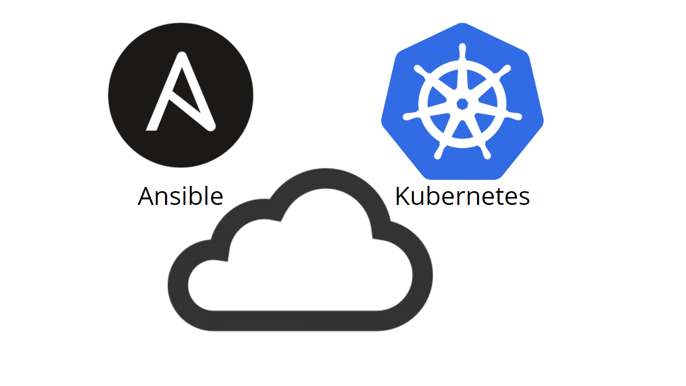

# Provisioning AKS, EKS, and GKE with Ansible

<p align="center">

</p>
## Requirements

Ansible 2.9+ needs to be [installed](https://docs.ansible.com/ansible/latest/installation_guide/intro_installation.html#installing-ansible-with-pip) in your computer to run this. [Python3](https://wiki.python.org/moin/BeginnersGuide/Download) as well.

```bash
python -m pip install --user ansible
```

## Cloud Provider details

- [AKS](aks.md) (work in progress)
- [EKS](eks.md) (work in progress)
- [GKE]() (todo)

## Creating a new Kubernetes Cluster

Follow these steps to provision a Kubernetes cluster.

1. Clone this repository: `git clone https://github.com/nleiva/ansible-kubernetes.git`

2. Make your cloud provider credentials available as environment variables (`export`). See [AKS](aks.md), [EKS](eks.md), or [GKE]() for more details.

```bash
export <credential>='...'
```

3. Run the [Playbook](main.yml) and wait a couple of minutes while your Kuberetes cluster is being provisioned. You need to specify the cloud provider via the variable `cloud_provider` (`aws`, `azure`, or `gcp`).

```bash
ansible-playbook main.yml -v --extra-vars "cloud_provider=azure"
```
   
