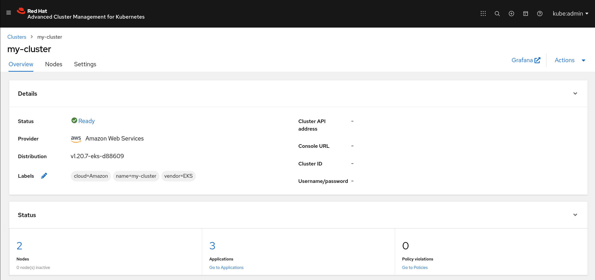
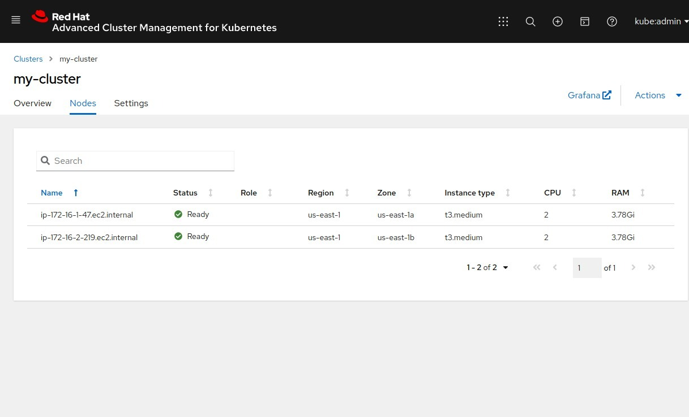

# Integrate with Red Hat® Advanced Cluster Management for Kubernetes (ACM)

## Requirements

### Python libraries

As we leverage the Ansible [Kubernetes Collection](https://github.com/ansible-collections/kubernetes.core), we need a couple of Python libraries to be present in the system.

```bash
pip install --user -r requirements_kubernetes.txt
```

### Ansible Collections

We need the Ansible [Kubernetes Collection](https://github.com/ansible-collections/kubernetes.core).

```bash
ansible-galaxy collection install -r collections/requirements.yml
```

## Creating and registering a new Kubernetes cluster with ACM

Follow these steps to provision an EKS cluster, for example, and have it added to [ACM](https://www.redhat.com/en/technologies/management/advanced-cluster-management).

1. Provide the filepath of ACM's Kubeconfig via the var `my_acm_config`.

2. Run the [Playbook](main.ym) with the extra-var `acm_import` set to `true`, and wait a couple of minutes while your Cluster is being provisioned and added to [ACM](https://www.redhat.com/en/technologies/management/advanced-cluster-management).

```bash
 ⇨  ansible-playbook main.yml -v --extra-vars "acm_import=true my_acm_config=~/.kube/config cloud_provider=aws"
```

## Deleting a Kubernetes cluster and removing it from ACM

Follow these steps to provision an EKS cluster, for example, and have it added to [ACM](https://www.redhat.com/en/technologies/management/advanced-cluster-management).

1. Provide the filepath of ACM's Kubeconfig via the var `my_acm_config`.

2. Run the [Playbook](main.ym) with the extra-var `acm_import` set to `true`, and `delete` as `true` to delete the Cluster and remove it from [ACM](https://www.redhat.com/en/technologies/management/advanced-cluster-management).

```bash
 ⇨  ansible-playbook main.yml -v --extra-vars "delete=true acm_import=true my_acm_config=~/.kube/config cloud_provider=aws"
```

## ACM GUI view

### Cluster

<p align="center">

</p>

### Worker nodes

<p align="center">

</p>