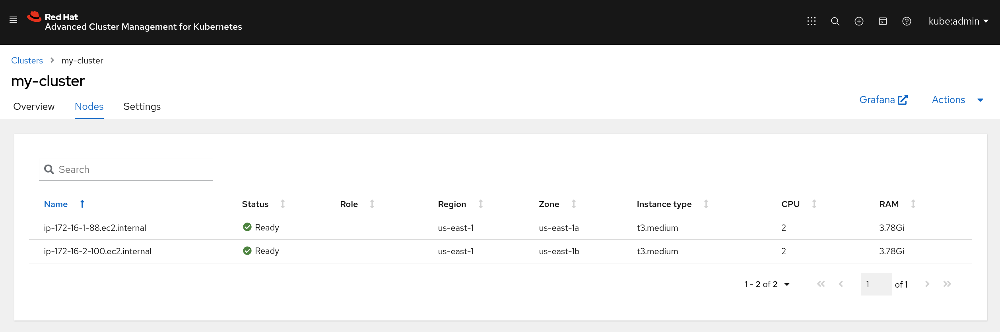

# Integrate with Red Hat® Advanced Cluster Management for Kubernetes (ACM)

## Requirements

### Python libraries

As we will leverage the Kubernetes module, we need a couple of Python libraries to be present in the system.

```bash
pip install --user -r requirements_kubernetes.txt
```

### Ansible Collections

We will also need the Ansible [Kubernetes Collection](https://github.com/ansible-collections/kubernetes.core).

```bash
ansible-galaxy collection install -r collections/requirements.yml
```

## Registering  new cluster with ACM

Follow these steps to provision an EKS cluster.

1. Provide the filepath of ACM's Kubeconfig via the var `my_acm_config`.

2. Run the [Playbook](main.ym) with the extra-var `acm_import` set to `true`, and wait a couple of minutes while your Cluster is being provisioned and added to ACM.

```bash
 ⇨  ansible-playbook main.yml -v --extra-vars "acm_import=true my_acm_config=~/.kube/config cloud_provider=aws"
```

## ACM GUI view

### Cluster

<p align="center">

</p>

### Worker nodes

<p align="center">

</p>