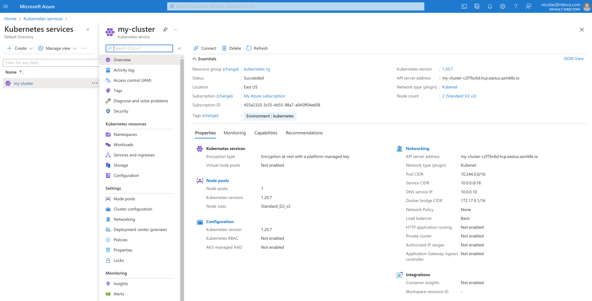

# Provisioning AKS with Ansible

## Requirements

### Python libraries

As we will interact with Azure, we need a couple of Python libraries to be present in the system.

```bash
pip install --user -r requirements_aks.txt
```

### Ansible Collections

We will also need the Ansible [collection for Azure](https://github.com/ansible-collections/azure#ansible-collection-for-azure).

```bash
ansible-galaxy collection install -r collections/requirements.yml
```

### Azure credentials

To authenticate via service principal, pass subscription_id, client_id, secret and tenant or set environment variables `AZURE_SUBSCRIPTION_ID`, `AZURE_CLIENT_ID`, `AZURE_SECRET` and `AZURE_TENANT`.

- `AZURE_SUBSCRIPTION_ID`: [Find your Azure subscription](https://docs.microsoft.com/en-us/azure/media-services/latest/setup-azure-subscription-how-to?tabs=portal)
- `AZURE_CLIENT_ID` and `AZURE_TENANT`: [Register an application with Azure AD and create a service principal](https://docs.microsoft.com/en-us/azure/active-directory/develop/howto-create-service-principal-portal#register-an-application-with-azure-ad-and-create-a-service-principal)
- `AZURE_SECRET`: [Create a new application secret](https://docs.microsoft.com/en-us/azure/active-directory/develop/howto-create-service-principal-portal#option-2-create-a-new-application-secret)


## Creating a new AKS Cluster

Follow these steps to provision an AKS cluster.

1. Clone this repository: `git clone https://github.com/nleiva/ansible-kubernetes.git`

2. Make your [Azure  service principal parameters](https://docs.microsoft.com/en-us/azure/active-directory/develop/howto-create-service-principal-portal) (`AZURE_SUBSCRIPTION_ID`, `AZURE_CLIENT_ID`, `AZURE_SECRET`, and `AZURE_TENANT`) available as environment variables (`export`).

```bash
export AZURE_SUBSCRIPTION_ID='...'
export AZURE_CLIENT_ID='...'
export AZURE_SECRET='...'
export AZURE_TENANT='...'
```

3. Run the [Playbook](main.yml) and wait a couple of minutes while AKS is being provisioned.

```bash
 ⇨  ansible-playbook main.yml -v --extra-vars "cloud_provider=azure"

<snip>

TASK [Create a managed Azure Container Services (AKS) cluster] *********************************************************************************************************************************
[WARNING]: Azure API profile latest does not define an entry for ContainerServiceClient
changed: [localhost] => {
    "aad_profile": {},
    "addon": {},
    "agent_pool_profiles": [
        {
            "availability_zones": null,
            "count": 2,
            "enable_auto_scaling": null,
            "max_count": null,
            "max_pods": 110,
            "min_count": null,
            "name": "kubernetes",
            "os_disk_size_gb": 128,
            "os_type": "Linux",
            "type": "AvailabilitySet",
            "vm_size": "Standard_D2_v2",
            "vnet_subnet_id": null
        }
    ],
    "changed": true,
    "dns_prefix": "my-cluster",
    "enable_rbac": false,
    "fqdn": "my-cluster-c2f7bc6d.hcp.eastus.azmk8s.io",
    "id": "/subscriptions/455e2320-3c55-4d55-98a7-a045ff04eXXX/resourcegroups/kubernetes-rg/providers/Microsoft.ContainerService/managedClusters/my-cluster",
    "kube_config": "apiVersion: ...\n",
    "kubernetes_version": "1.20.7",
    "linux_profile": {
        "admin_username": "nleiva",
        "ssh_key": "VALUE_SPECIFIED_IN_NO_LOG_PARAMETER"
    },
    "location": "eastus",
    "name": "my-cluster",
    "network_profile": {
        "dns_service_ip": "10.0.0.10",
        "docker_bridge_cidr": "172.17.0.1/16",
        "load_balancer_sku": "Basic",
        "network_plugin": "kubenet",
        "network_policy": null,
        "pod_cidr": "10.244.0.0/16",
        "service_cidr": "10.0.0.0/16"
    },
    "node_resource_group": "MC_kubernetes-rg_my-cluster_eastus",
    "provisioning_state": "Succeeded",
    "service_principal_profile": {
        "client_id": "d0d37339-806f-4dfa-be3b-affc58014XXX"
    },
    "tags": {
        "Environment": "kubernetes"
    },
    "type": "Microsoft.ContainerService/ManagedClusters"
}
```

## Azure Portal view

<p align="center">

</p>