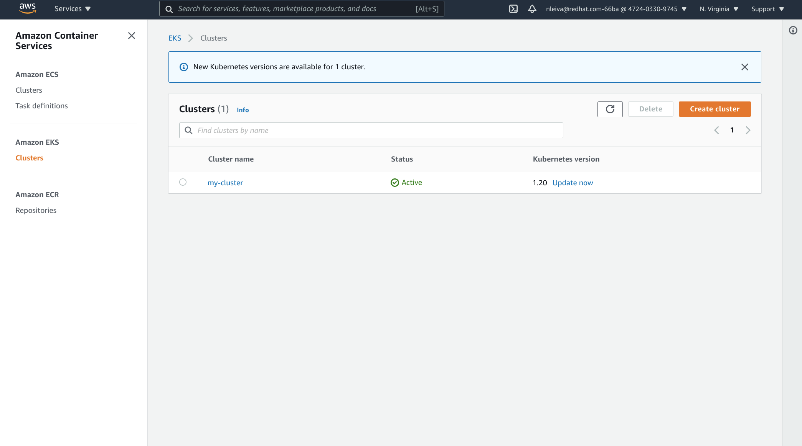

# Provisioning EKS with Ansible

## Requirements

### Python libraries

As we will interact with AWS, we need a couple of Python libraries to be present in the system.

```bash
pip install --user -r requirements_eks.txt
```

### Ansible Collections

We will also need the Ansible [Amazon AWS Collection](https://github.com/ansible-collections/amazon.aws#amazon-aws-collection).

```bash
ansible-galaxy collection install -r collections/requirements.yml
```

## Creating a new EKS Cluster

Follow these steps to provision an EKS cluster.

1. Clone this repository: `git clone https://github.com/nleiva/ansible-kubernetes.git`

2. Make your [AWS account credentials](https://docs.aws.amazon.com/general/latest/gr/aws-sec-cred-types.html#access-keys-and-secret-access-keys) (`AWS_ACCESS_KEY_ID` and `AWS_SECRET_ACCESS_KEY`) available as environment variables (`export`).

```bash
export AWS_ACCESS_KEY_ID='...'
export AWS_SECRET_ACCESS_KEY='...'
```

3. Run the [Playbook](main.ym) and wait a couple of minutes while EKS is being provisioned.

```json
 ⇨  ansible-playbook main.yml -v --extra-vars "cloud_provider=aws"

<snip>
   
TASK [aws_create_eks : Print out EKS return info] ***********************************************************************************
ok: [localhost] => {
    "msg": {
        ...
        "name": "my-cluster",
        "platform_version": "eks.8",
        "resources_vpc_config": {
            "cluster_security_group_id": "sg-0ef6587703facbXXX",
            "endpoint_private_access": false,
            "endpoint_public_access": true,
            "public_access_cidrs": [
                "0.0.0.0/0"
            ],
            "security_group_ids": [
                "sg-002815218a770a775"
            ],
            "subnet_ids": [
                "subnet-08669dda493cbcXXX",
                "subnet-08f5f57ef88d6bXXX"
            ],
            "vpc_id": "vpc-0248e5e848752fXXX"
        },
        "role_arn": "arn:aws:iam::901353702XXX:role/kubernetes-role",
        "status": "ACTIVE",
        "tags": {},
        "version": "1.18"
    }
}

PLAY RECAP **************************************************************************************************************************
localhost                  : ok=20   changed=5    unreachable=0    failed=0    skipped=4    rescued=0    ignored=0   

```

## AWS Console view

<p align="center">

</p>

## AWS CLI

- `AWS_CONFIG_FILE`: Specifies the location of the file that the AWS CLI uses to store configuration profiles. 
- `AWS_SHARED_CREDENTIALS_FILE`: Specifies the location of the file that the AWS CLI uses to store access keys.

### Kubeconfig

[Create a kubeconfig for Amazon EKS](https://docs.aws.amazon.com/eks/latest/userguide/create-kubeconfig.html).

## Links

- [Amazon EKS security group considerations](https://docs.aws.amazon.com/eks/latest/userguide/sec-group-reqs.html)