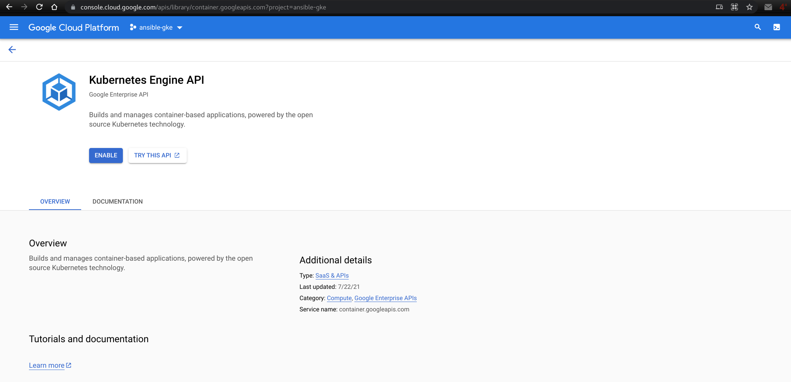

# Provisioning GKE with Ansible

## Requirements

### Python libraries

As we will interact with Azure, we need a couple of Python libraries to be present in the system.

```bash
pip install --user -r requirements_aks.txt
```

### Ansible Collections

We will also need the Ansible [collection for Google Cloud](https://galaxy.ansible.com/google/cloud).

```bash
ansible-galaxy collection install -r collections/requirements.yml
```

### GCP credentials

To authenticate provide the following [environment variables](https://docs.ansible.com/ansible/latest/scenario_guides/guide_gce.html#providing-credentials-as-environment-variables) `GCP_PROJECT`, `GCP_AUTH_KIND`, and `GCP_SERVICE_ACCOUNT_FILE`.

- `GCP_PROJECT`: GCP Project ID.
- `GCP_AUTH_KIND`: The type of credential used (`application`, `machineaccount`, or `serviceaccount`).
- `GCP_SERVICE_ACCOUNT_FILE`: The path of a Service Account JSON file if `serviceaccount` is selected as type.

You need to [grant resource access](https://cloud.google.com/iam/docs/granting-changing-revoking-access#access-control-via-console) to your [service account](https://developers.google.com/identity/protocols/oauth2/service-account#creatinganaccount). For example you can assign these roles: `Compute Admin`, `Kubernetes Engine Admin`, and `Service Account User` (iam.serviceAccountUser).

<p align="center">

</p>

## Enable Kubernetes Engine API

[Via the console](https://console.cloud.google.com/apis/library/container.googleapis.com).

<p align="center">

</p>

## Creating a new GKE Cluster

Follow these steps to provision an AKS cluster.

1. Clone this repository: `git clone https://github.com/nleiva/ansible-kubernetes.git`

2. Make your [GCP Credentials](https://cloud.google.com/docs/authentication/production) (`GCP_PROJECT`, `GCP_AUTH_KIND``, and `GCP_SERVICE_ACCOUNT_FILE`) available as environment variables (`export`).

```bash
export GCP_PROJECT='...'
export GCP_AUTH_KIND='...'
export GCP_SERVICE_ACCOUNT_FILE='...'
```

3. Run the [Playbook](main.yml) and wait a couple of minutes while GKE is being provisioned.

```json
 ⇨  ansible-playbook main.yml -v --extra-vars "cloud_provider=gcp"

<snip>

TASK [gcp_create_gke : Create GKE cluster] *****************************************************************************************************************************************************
changed: [localhost] => {
    "addonsConfig": {
        "gcePersistentDiskCsiDriverConfig": {
            "enabled": true
        },
        "kubernetesDashboard": {
            "disabled": true
        },
        "networkPolicyConfig": {}
    },
    "changed": true,
    "clusterIpv4Cidr": "10.108.0.0/14",
    "createTime": "2021-08-10T16:59:06+00:00",
    "currentMasterVersion": "1.20.8-gke.900",
    "currentNodeCount": 2,
    "currentNodeVersion": "1.20.8-gke.900",
    "databaseEncryption": {
        "state": "DECRYPTED"
    },
    "defaultMaxPodsConstraint": {
        "maxPodsPerNode": "110"
    },

<snip>

    "status": "RUNNING",
    "subnetwork": "kubernetes-vpc",
    "zone": "us-east4-a"
}

TASK [gcp_create_gke : Create k8s node pool] ***************************************************************************************************************************************************
changed: [localhost] => {
    "changed": true,

<snip>

    "upgradeSettings": {
        "maxSurge": 1
    },
    "version": "1.20.8-gke.900"
}

PLAY RECAP *************************************************************************************************************************************************************************************
localhost                  : ok=11   changed=2    unreachable=0    failed=0    skipped=4    rescued=0    ignored=0   

```

## GCP Console view

<p align="center">

</p>